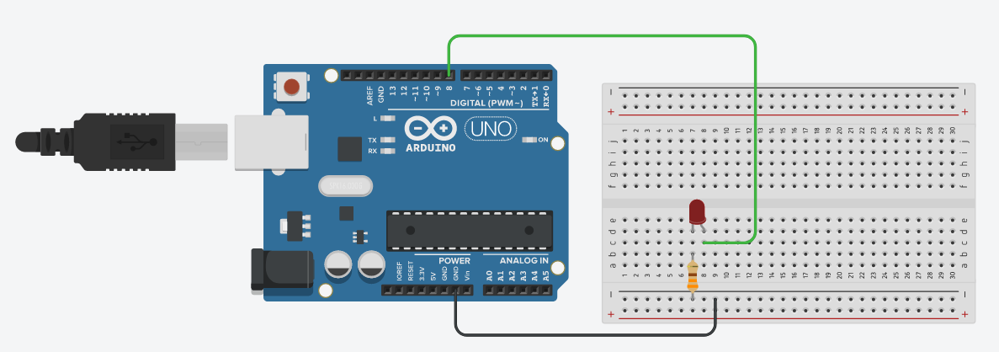

# Introduction to Arduino Uno<a name="arduino"></a>

## What is an Arduino Uno? 

* Arduino Uno is a microcontroller board with 14 digital input/output pins and 6 analog input pins.
* Runs a fixed set of instructions every time it is turned on.
* You can think of an Arduino as a computer that runs a fixed program every time it is turned on.

For more details: https://store.arduino.cc/usa/arduino-uno-rev3

## What can an Arduino Uno do?

* The Arduino can be thought of as a big switch that can read inputs.
* You can program the Arduino to do limitless things just by manipulating when to output a `HIGH` or `LOW` based on the values it is reading.

## Getting to know the Arduino Uno

// Arduino pictures highlighting important parts

### Arduino Uno Pins


## Arduino IDE

// Arduino IDE pictures

## Built-in Arduino functions

### Basics

The Arduino communicates with your computer by plugging into a USB port. This communication  is called "serial communication". 

* [`Serial.begin(speed)`](https://www.arduino.cc/reference/en/language/functions/communication/serial/begin/) - Sets the rate of serial data transfer between the Arduino and your computer.  The value is not very important, just make sure that you know what value you set it to.

```c++
void setup() {
    Serial.begin(9600);       // opens serial port, sets data rate to 9600 bps
}
```


* [`pinMode(pin, mode)`](https://www.arduino.cc/reference/en/language/functions/digital-io/pinmode/) - Sets a pin on the Arduino to behave either as an input or output. The pins default to inputs, but it is good to explicitly set the pin mode in the setup(). Input configures the pin to be used to read the voltage and return `HIGH` or `LOW` to the program. Output configures the pin to output `HIGH` or `LOW` from the program to the Arduino.

  > The analog input pins can be used as digital pins, referred to as A0, A1, etc.

```c++
void setup() {
    pinMode(10, OUTPUT);        // sets the digital pin 10 as output
    pinMode(11, INPUT);         // sets the digital pin 11 as input
    pinMode(12, INPUT_PULLUP)   // sets the digital pin 12 as input, enabling the internal pullup resistor
}
```


* [`digitalRead(pin)` ](https://www.arduino.cc/reference/en/language/functions/digital-io/digitalread/) - Reads the voltage from a specific digital pin and returns `HIGH` or `LOW` to the program.

  > Note:
  >
  > If the pin isn’t connected to anything, `digitalRead()` can return either `HIGH` or `LOW` (and this can change randomly).

```c++
int buttonPin = 7;    // pushbutton connected to digital pin 7
int val = 0;          // variable to store the read value

void setup() {
    pinMode(buttonPin, INPUT);    // sets the digital pin 7 as input
}

void loop() {
    val = digitalRead(inPin);   // read the input pin using digitalRead()
    Serial.println(val);  // shows the input value read
}
```


* [`digitalWrite(pin, value)`](https://www.arduino.cc/reference/en/language/functions/digital-io/digitalwrite/) - This function outputs a `HIGH` or `LOW` value to the specified digital pin

```c++
void setup() {
    pinMode(13, OUTPUT);    // sets the digital pin 13 as output
}

void loop() {
    digitalWrite(13, HIGH); // sets the digital pin 13 on
    delay(1000);            // waits for a second
    digitalWrite(13, LOW);  // sets the digital pin 13 off
    delay(1000);            // waits for a second
}
```

### Printing

* [`Serial.println()`](https://www.arduino.cc/reference/en/language/functions/communication/serial/println/) - 
* [`Serial.print()`](https://www.arduino.cc/reference/en/language/functions/communication/serial/print/) - 

### Activity 1: Make a LED blink

In this activity, we will use the Arduino Uno to make a LED blink. 

Wire up your circuit as follows:



In the above circuit, we connected an LED to __pin 8__ of the Arduino Uno. A __330 ohm__ resistor is also connected in series in order to limit the flow of current to the LED as high currents will cause the LED to blow (don't worry it wouldn't explode).


Fill in the code below using what we have learnt so far! You can find the solutions in `Activity-answers.md`.

```c++
void setup() {
    // sets digital pin 8 as output
}

void loop() {
    // sets digital pin on
    delay(1000);    // waits for a second
    // sets digital pin off
    delay(1000):    // waits for a second
}
```


Upload the sketch to your Arduino Uno using the upload button in the Arduino IDE and watch your LED blink.

Congratulations, you've written your first Arduino program!